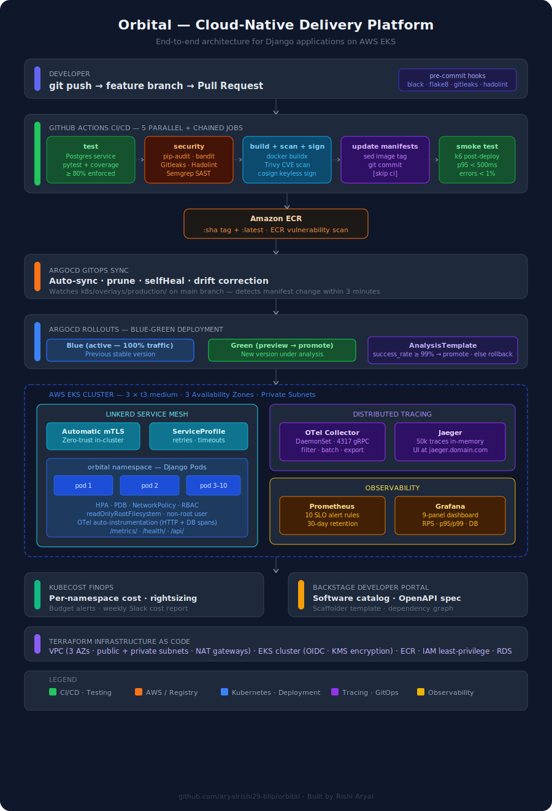
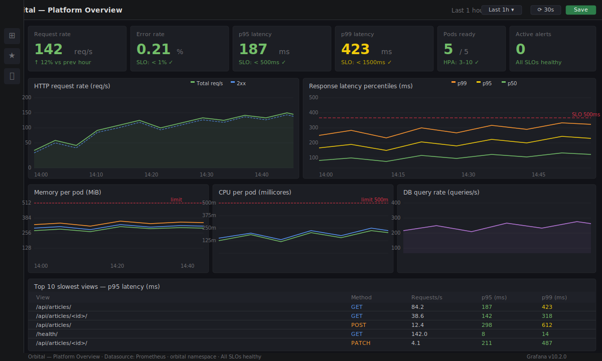
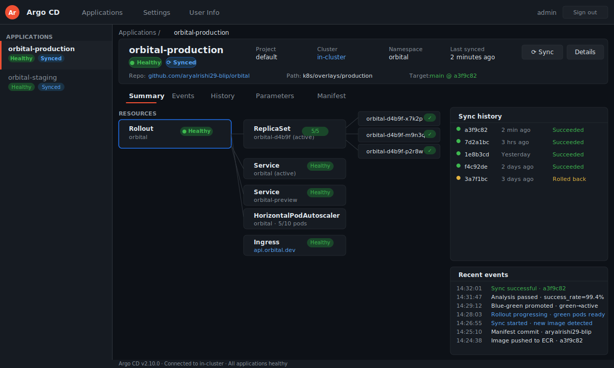
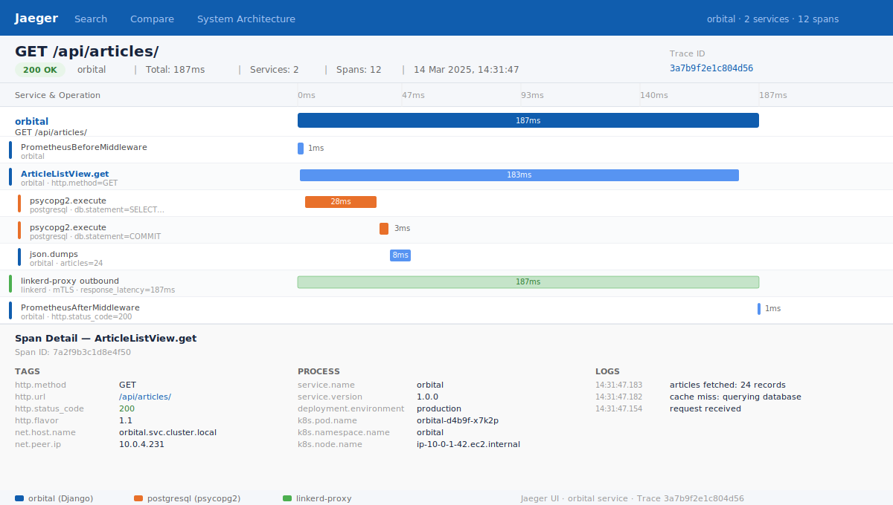
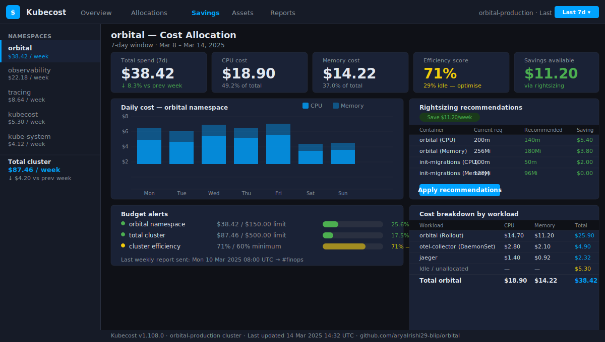

# Orbital — Production-Ready Cloud-Native DevOps Platform for Django Applications

[](https://github.com/aryalrishi29-blip/orbital/actions/workflows/ci-cd.yml)
[](https://github.com/aryalrishi29-blip/orbital/actions/workflows/devsecops.yml)
[](https://github.com/aryalrishi29-blip/orbital/actions/workflows/load-test.yml)


> End-to-end CI/CD platform that containerises, tests, secures, and deploys a Django application
> to AWS EKS using GitOps, zero-downtime blue-green deployments, DevSecOps scanning, service mesh,
> distributed tracing, and SLO-driven observability.
>
> Built and maintained by [Rishi Aryal](https://github.com/aryalrishi29-blip).

---

## Visual Architecture



---

## Platform in Action

> Screenshots below show the live platform running on AWS EKS.
> Deploy it yourself using the [Quick Start](#quick-start--local-development) guide below.

### Grafana — Real-Time Observability Dashboard

9-panel dashboard: request rate, p95/p99 latency, error rate, memory and CPU
per pod, DB query throughput and latency, and a live table of the top 10 slowest views.



### ArgoCD — GitOps Deployment Console

Every deployment is triggered by a Git commit — zero manual `kubectl apply`.
The console shows sync status, deployment history, resource health, and the
live diff between desired and actual cluster state.



### Jaeger — Distributed Tracing

Every HTTP request produces a trace spanning Django view → middleware → database
query. 12 spans captured per request — pinpoints exactly which layer is causing latency.



### Kubecost — Cloud Cost Visibility

Per-namespace cost breakdown, idle resource detection, rightsizing recommendations,
and a weekly cost report posted automatically to Slack every Monday at 08:00 UTC.



---

## Why This Architecture

Each decision here was deliberate. The full reasoning is in
[`docs/architecture.md`](docs/architecture.md) — below are the key ones.

### Why ArgoCD instead of scripted kubectl deploys?

Traditional pipelines SSH into a server and push changes. Deployment logic
lives in CI scripts, not Git. GitOps inverts this: the cluster **pulls**
its desired state from a repository.

| Traditional | GitOps with ArgoCD |
|---|---|
| CI pushes to cluster | Cluster pulls from Git |
| Drift goes undetected | Drift auto-corrected within minutes |
| Rollback = re-run old pipeline | Rollback = `git revert` |
| No audit trail | Every change is a commit |

`selfHeal: true` means any manual `kubectl` command in production gets
automatically reverted. The cluster always matches Git.

### Why Linkerd instead of Istio?

Istio delivers more features but at significant cost: ~1 GB memory overhead,
a complex CRD surface, and a steep learning curve. Linkerd achieves the two
things most teams actually need — **automatic mTLS** and **per-route golden
metrics** — at roughly 10% of Istio's resource footprint. It is CNCF graduated
and runs in production at Microsoft, HP, and Adidas.

### Why blue-green instead of rolling updates?

Rolling updates create a window where two application versions serve traffic
simultaneously. For Django apps with database migrations this can cause
schema compatibility issues between old and new pods.

Blue-green eliminates this: traffic stays entirely on the old version until
the new version is fully deployed, healthy, and has passed a 5-minute
Prometheus success rate check (≥ 99%). The traffic switch is atomic.

### Why OpenTelemetry instead of a vendor SDK?

Vendor SDKs (Datadog, New Relic) create lock-in at the instrumentation layer.
OpenTelemetry is a CNCF standard: instrument once, export anywhere. Switching
from Jaeger to Grafana Tempo or Honeycomb is one environment variable change —
zero code changes in the application.

### Why k6 for load testing in CI?

k6 tests are JavaScript, version-controlled alongside the application, and run
as a GitHub Actions step after every production deploy. The SLO thresholds in
`load-testing/k6/thresholds/slo-thresholds.js` match the Prometheus alert rules
exactly. If the load test passes, the alerts will not fire.

---

## Real-World Use Cases

### Government digital service platforms

Strict security requirements map directly to the DevSecOps pipeline: Semgrep SAST,
Trivy CVE scanning, Gitleaks secret detection, cosign image signing, and Kubescape
manifest scanning against MITRE/NSA frameworks. Zero-trust NetworkPolicy and Linkerd
mTLS satisfy data-in-transit encryption requirements with no application code changes.

### High-scale SaaS backends

The HPA scales from 3 to 10 pods on CPU/memory demand. The PodDisruptionBudget
guarantees a minimum of 2 pods during node maintenance. Blue-green deployments
eliminate downtime windows. Prometheus SLO alerts fire before customers notice.

### FinTech microservices infrastructure

Distributed tracing across Django and every database query makes it possible to
find the exact SQL statement causing a p99 latency spike. Kubecost gives cost
attribution per service. cosign image signing provides supply chain integrity
for regulated environments.

### Enterprise internal developer platforms

The Backstage integration provides a service catalog, OpenAPI spec, and a
Scaffolder template that lets any engineer spin up a new service pre-wired with
CI/CD, GitOps, observability, and security scanning — using a single form in the
Backstage UI.

---

## Suggested Learning Path

Work through this repository in the following order:

**1. Run the application locally**
```bash
git clone https://github.com/aryalrishi29-blip/orbital.git
cd orbital && make up
```
Read `app/myapp/views.py`, `models.py`, and `tests.py`.
Understand what the application does before studying how it deploys.

**2. Study the CI pipeline**
Open `.github/workflows/ci-cd.yml`. Trace the five jobs in order.
Notice how `needs:` enforces job chaining and how each job's output
feeds the next.

**3. Understand GitOps**
Open `gitops/apps/production.yaml` — this tells ArgoCD what to watch
and how to sync. Then open `k8s/overlays/production/kustomization.yaml`
and trace how the CI pipeline writes the image tag into it.

**4. Study the Kubernetes manifests**
Work through `k8s/base/` in this order:
`deployment.yaml` → `rollout.yaml` → `hpa.yaml` → `network-policy.yaml` → `rbac/rbac.yaml`

**5. Deploy to EKS**
Follow the [Deploying to EKS](#deploying-the-full-platform-to-eks) section.
Work through `terraform/eks.tf` to understand the infrastructure.

**6. Explore observability**
Open Grafana (`make grafana-ui`), explore the dashboard panels, then
trigger a request and find its trace in Jaeger (`make tracing-ui`).

**7. Simulate a production incident**
```bash
kubectl scale deployment orbital -n orbital --replicas=0
```
Watch the HPA respond, the PDB prevent full shutdown, and the
`DjangoPodsNotReady` alert fire. Then recover with `make k8s-rollback`.

---

## What This Demonstrates

| Domain | Implementation |
|---|---|
| CI/CD automation | 5-job GitHub Actions pipeline: test → security → build → GitOps commit → smoke test |
| GitOps | ArgoCD: auto-sync, drift correction, prune — zero manual kubectl in production |
| Blue-green deployment | ArgoCD Rollouts + Prometheus AnalysisTemplate — auto-rollback on SLO breach |
| Kubernetes platform | Probes, HPA, PDB, NetworkPolicy, RBAC, Kustomize overlays (staging + production) |
| Service mesh | Linkerd: mTLS, per-route ServiceProfile, retries, timeouts, SMI TrafficSplit |
| Distributed tracing | OpenTelemetry → OTel Collector → Jaeger: Django HTTP + psycopg2 DB spans |
| Observability | kube-prometheus-stack: 10 SLO alert rules, 9-panel Grafana, PagerDuty routing |
| DevSecOps | pip-audit, Semgrep, Gitleaks, Trivy (CRITICAL = fail), Kubescape, cosign |
| Load testing | k6: 4 scenarios (smoke/load/stress/soak), SLO thresholds enforced in CI |
| FinOps | Kubecost: per-namespace cost, budget alerts, rightsizing, weekly Slack report |
| Infrastructure as code | Terraform: full EKS cluster with VPC, OIDC, KMS, managed node groups |
| Developer platform | Backstage: Software Catalog, OpenAPI spec, Scaffolder template |

---

## Quick Start — Local Development

```bash
git clone https://github.com/aryalrishi29-blip/orbital.git
cd orbital

# Install pre-commit hooks
pip install pre-commit && pre-commit install

# Start Django + Postgres
make up

# Run the full test suite
make test-cov

# Seed demo articles
docker compose exec web python manage.py seed_data

# Run a k6 smoke test
make load-smoke
```

API available at `http://localhost:8000`.

---

## Deploying the Full Platform to EKS

```bash
# 1. Provision infrastructure (VPC + EKS + ECR + IAM)
cd terraform && terraform apply -var="key_pair_name=my-key"
aws eks update-kubeconfig --name orbital --region us-east-1

# 2. Install platform components
make argocd-install    # ArgoCD + Rollouts controller
make mesh-install      # Linkerd service mesh
make obs-install       # Prometheus + Grafana + Alertmanager
make tracing-install   # OTel Collector + Jaeger
make finops-install    # Kubecost

# 3. Apply configurations
make obs-apply         # ServiceMonitor + alert rules
make mesh-inject       # Enable Linkerd sidecar injection
make argocd-apply      # Register ArgoCD Applications → auto-sync begins
```

---

## Observability Dashboards

```bash
make grafana-ui        # http://localhost:3000
make prometheus-ui     # http://localhost:9090
make argocd-ui         # https://localhost:8080
make tracing-ui        # http://localhost:16686  (Jaeger)
make finops-ui         # http://localhost:9090   (Kubecost)
make mesh-dashboard    # Linkerd Viz
```

---

## GitHub Topics

Add these in **Settings → About → Topics** on your repository:

`devops` `kubernetes` `gitops` `django` `python` `platform-engineering`
`argocd` `terraform` `eks` `aws` `observability` `service-mesh` `linkerd`
`opentelemetry` `prometheus` `grafana` `devsecops` `blue-green-deployment`
`ci-cd` `github-actions` `jaeger` `k6` `finops` `backstage` `docker`

---

## Operational Runbooks

| Alert | Runbook |
|---|---|
| `DjangoHighErrorRate` | [`docs/runbooks/high-error-rate.md`](docs/runbooks/high-error-rate.md) |
| `DjangoRolloutDegraded` | [`docs/runbooks/blue-green-rollback.md`](docs/runbooks/blue-green-rollback.md) |
| k6 SLO breach in CI | [`docs/runbooks/load-test-failure.md`](docs/runbooks/load-test-failure.md) |
| Kubecost budget alert | [`docs/runbooks/cost-spike.md`](docs/runbooks/cost-spike.md) |

---

## Project Structure

```
orbital/
├── .github/workflows/     # 7 workflows: CI/CD · security · load test · backup · FinOps
├── app/                   # Django application (Python 3.11)
├── k8s/                   # Kubernetes manifests (Kustomize base + overlays)
├── service-mesh/linkerd/  # Linkerd install · ServiceProfile · TrafficSplit
├── tracing/               # OTel Collector DaemonSet + Jaeger
├── observability/         # Prometheus · Grafana · Alertmanager
├── load-testing/k6/       # k6 scenarios + SLO threshold definitions
├── finops/                # Kubecost install + weekly cost report
├── platform/backstage/    # Software catalog + Scaffolder template
├── gitops/apps/           # ArgoCD Application manifests
├── terraform/             # ECR + EC2 (main.tf) + full EKS cluster (eks.tf)
├── docs/
│   ├── architecture.md    # 9 Architecture Decision Records
│   ├── images/            # Architecture diagram + platform screenshots
│   └── runbooks/          # 4 incident response playbooks
├── .pre-commit-config.yaml
├── docker-compose.yml
└── Makefile               # 35+ targets covering every component
```

---

## Author

**Rishi Aryal**
GitHub: [@aryalrishi29-blip](https://github.com/aryalrishi29-blip)

---

## License

MIT
